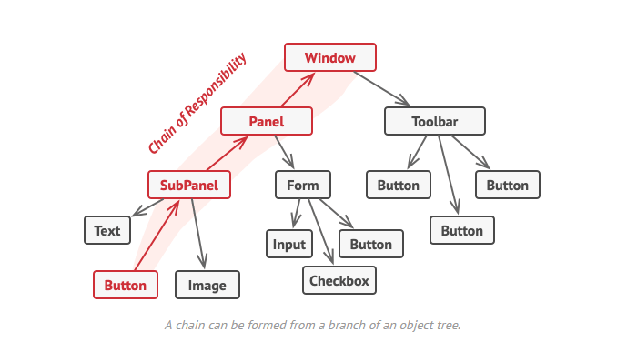
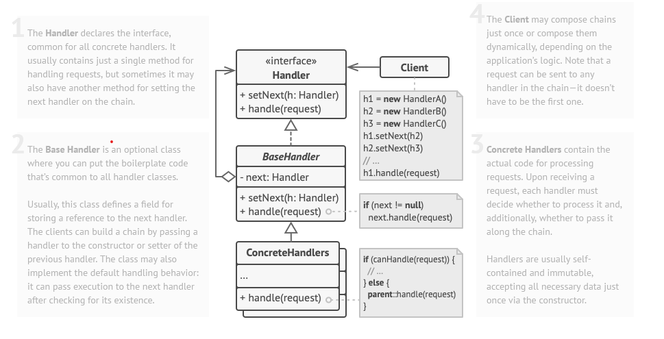

## Chain Of Responsability / Chaine de responsabilité

## Le problème

Imaginez  une longue chaine de composants imbriqués les uns dans les autres. Par exemple une interface graphique avec des boutons, des fenêtres, des barres d'outils...
On représente cette hierarchie par un arbre.

Comment au mieux gérer les évènements parents/enfants ? Si j'agrendit une checkbox comment dire au composant parent par exemple le panel de s'agrandir aussi? On peux gérer ça avec un if/switch, mais ça viole le principe de responsabilité unique et le principe d'ouverture/fermeture.

## Le patron de conception

## Avantages et inconvénients

+ Vous pouvez contrôler l'ordre de traitement des demandes.
+ Principe de responsabilité unique. Vous pouvez découpler les classes qui invoquent des opérations des classes qui effectuent des opérations.
+ Principe d'ouverture/fermeture. Vous pouvez introduire de nouveaux gestionnaires dans l'application sans casser le code client existant.

- Certaines requêtes peuvent finir par ne pas être traitées.
