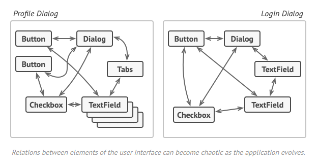
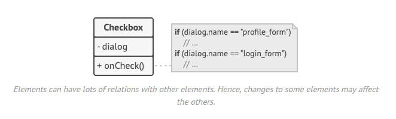
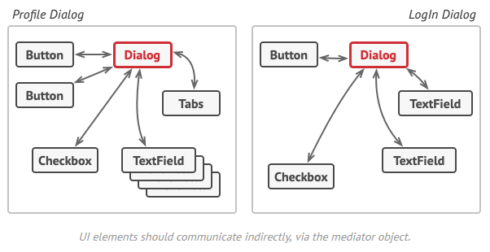
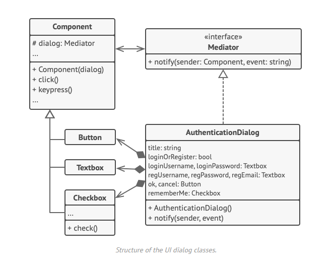

## Mediator / Médiateur

## Le problème

Dans le cas où on se retrouve avec des relations chaotiques entre les objets, comment mieux gérer les interraction entre eux ?

Si on fait comme cela on ne respecte pas le premier principe (responsabilité unique) ni le second principe (ouveture fermeture).

## Le patron de conception

On centralise la logique d'interraction dans un objet médiateur qui va s'occuper de la logique des objets.

# Relation avec d'autre patrons de conceptions

- La chaîne de responsabilité, la commande, le médiateur et l'observateur traitent des différentes manières de connecter les émetteurs et les récepteurs de requêtes.
- La façade et le médiateur ont des fonctions similaires : ils tentent d'organiser la collaboration entre de nombreuses classes étroitement couplées.

## Avantages et inconvénients

+ Principe de responsabilité unique. Vous pouvez extraire les communications entre les différents composants en un seul endroit, ce qui facilite la compréhension et la maintenance.
+ Principe d'ouverture/fermeture. Vous pouvez introduire de nouveaux médiateurs sans avoir à modifier les composants réels.
+ Vous pouvez réduire le couplage entre les différents composants d'un programme.
+ Vous pouvez réutiliser les composants individuels plus facilement.

- Au fil du temps, un médiateur peut évoluer vers un objet Dieu.

