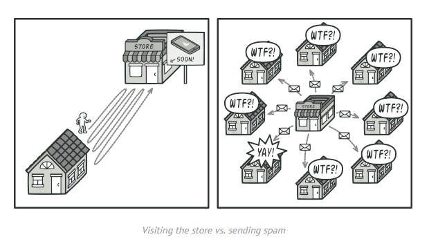
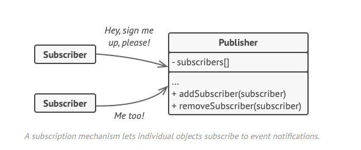
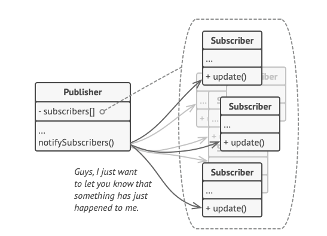
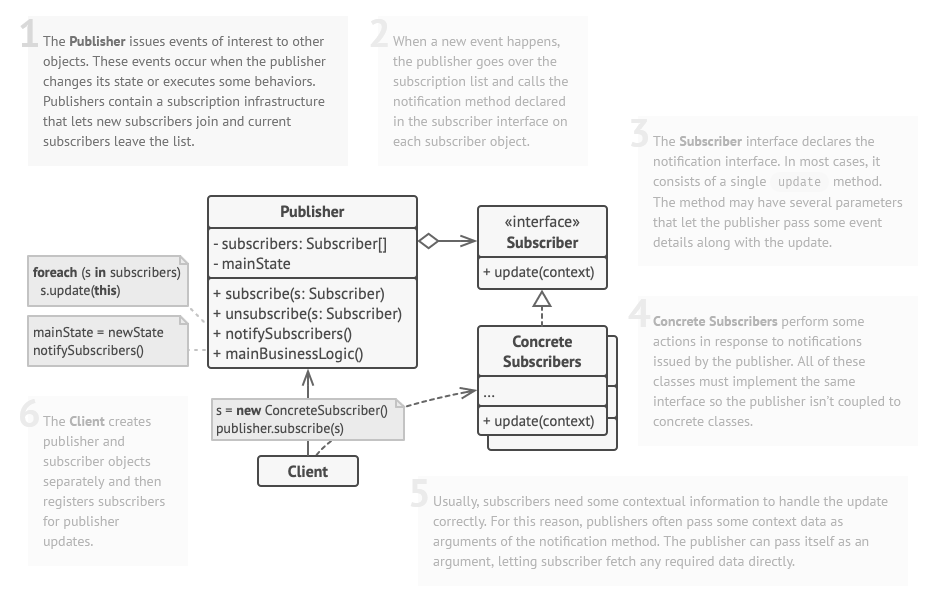

## Observer / Observeur

## Le problème

Imaginez que vous avez deux types d'objets : un client et un magasin. Le client est très intéressé par un produit d'une marque particulière (disons, un nouveau modèle d'iPhone) qui devrait être disponible dans le magasin très prochainement.

Le client pourrait visiter le magasin tous les jours et vérifier la disponibilité du produit. Mais tant que le produit est encore en route, la plupart de ces déplacements seraient inutiles.
Visite du magasin ou envoi de spam

D'un autre côté, le magasin pourrait envoyer des tonnes d'e-mails (qui pourraient être considérés comme du spam) à tous les clients chaque fois qu'un nouveau produit est disponible. Cela éviterait à certains clients de se rendre sans cesse au magasin. En même temps, cela contrarierait d'autres clients qui ne sont pas intéressés par les nouveaux produits.

Il semble que nous soyons en présence d'un conflit. Soit le client perd du temps à vérifier la disponibilité du produit, soit le magasin gaspille des ressources à avertir les mauvais clients.

## Le patron de conception

Les observateurs qui veulent être notifié d'un événement vont être ajouté au publicateur.

Ils vont pouvoir ensuite tous être notifiés via l'appel d'une méthode du publisher.

Patron complet :

## Avantages et inconvénients

+ Principe d'ouverture/fermeture. Vous pouvez introduire de nouvelles classes d'abonnés sans avoir à modifier le code de du publisher (et vice versa s'il y a une interface au publisher).
+ Vous pouvez établir des relations entre les objets au moment de l'exécution.

- Les abonnés sont notifiés dans un ordre aléatoire.

