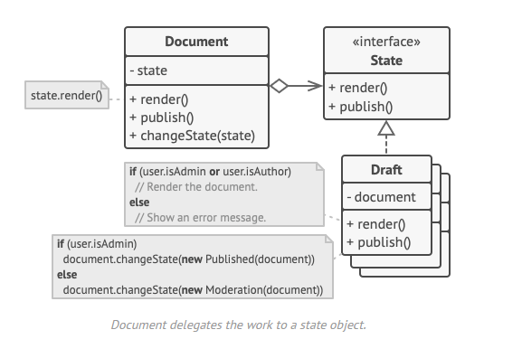

## Observer / Observeur

## Le problème

Le modèle d'état est étroitement lié au concept de machine à états finis.

L'idée principale est qu'à tout moment, il existe un nombre fini d'états dans lesquels un programme peut se trouver. Dans chaque état unique, le programme se comporte différemment, et le programme peut passer d'un état à un autre instantanément. Cependant, en fonction de l'état actuel, le programme peut ou non passer à certains autres états. Ces règles de commutation, appelées transitions, sont également finies et prédéterminées.

La plus grande faiblesse d'une machine d'état sur les conditionnels se révèle lorsque nous commençons à ajouter de plus en plus d'états et de comportements dépendants des états à la classe Document. La plupart des méthodes contiennent des conditionnels monstrueux qui choisissent le comportement approprié d'une méthode en fonction de l'état actuel. Un tel code est très difficile à maintenir car toute modification de la logique de transition peut nécessiter de changer les conditionnels d'état dans chaque méthode.

## Le patron de conception

Le modèle State suggère de créer de nouvelles classes pour tous les états possibles d'un objet et d'extraire tous les comportements spécifiques à un état dans ces classes.

Pour faire passer le contexte dans un autre état, remplacez l'objet d'état actif par un autre objet qui représente ce nouvel état. Cela n'est possible que si toutes les classes d'état suivent la même interface et que le contexte lui-même travaille avec ces objets par le biais de cette interface.

## Avantages et inconvénients

+ Principe de responsabilité unique. Organiser le code lié à des états particuliers dans des classes séparées.
+ Principe d'ouverture/fermeture. Introduire de nouveaux états sans modifier les classes d'états existantes ou le contexte.
+ Simplifier le code du contexte en éliminant les conditionnels encombrants de la machine d'état.

- L'application de ce modèle peut s'avérer excessive si un automate d'états ne comporte que quelques états ou s'il change rarement.

Traduit avec www.DeepL.com/Translator (version gratuite)

