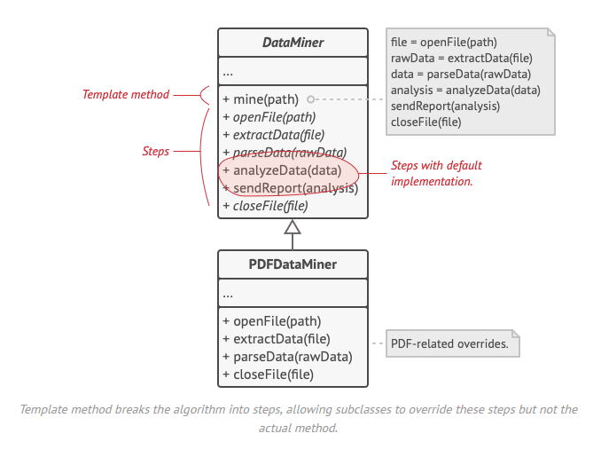

# Template Method / Patron de méthode

## Le problème

Voir problem.ts

## Le patron de conception

## Avantages et inconvénients

+ Vous pouvez permettre aux clients de ne remplacer que certaines parties d'un grand algorithme, ce qui les rend moins affectés par les modifications apportées à d'autres parties de l'algorithme.
+ Vous pouvez regrouper le code dupliqué dans une superclasse.

- Certains clients peuvent être limités par le squelette fourni d'un algorithme.
- Vous pourriez violer le principe de substitution de Liskov en supprimant l'implémentation d'une étape par défaut via une sous-classe.
- Plus le nombre d'étapes est élevé, plus les méthodes modèles ont tendance à être difficiles à maintenir.
