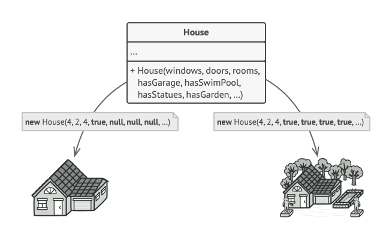
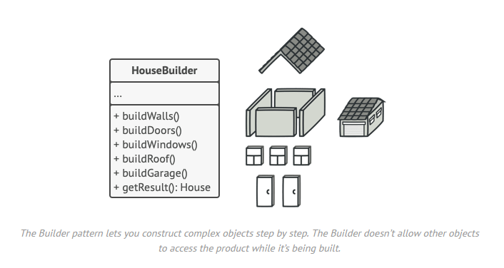
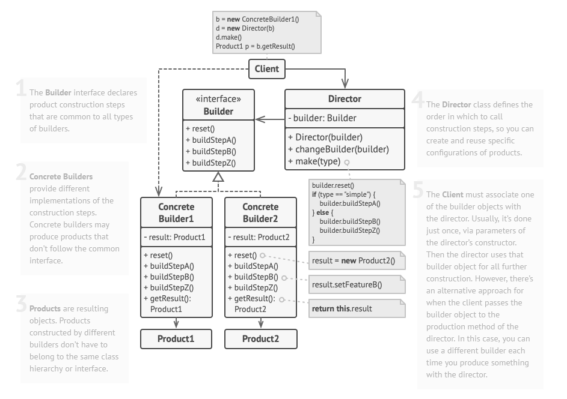

# Builder / Monteur

## Le problème

Imaginez un objet complexe qui nécessite une initialisation laborieuse, étape par étape, de nombreux champs et objets imbriqués. 
Un tel code d'initialisation est généralement enfoui dans un constructeur monstrueux avec beaucoup de paramètres. Ou pire encore : éparpillé dans tout le code client.

Par exemple, réfléchissons à la façon de créer un objet Maison. Pour construire une maison simple, vous devez construire quatre murs et un plancher, 
installer une porte, mettre une paire de fenêtres et construire un toit. Mais que se passe-t-il si vous voulez une maison plus grande, plus lumineuse, avec un jardin et d'autres éléments (comme un système de chauffage, une plomberie, etc.) ? (comme un système de chauffage, une plomberie et un câblage électrique) ?

Il existe une autre approche qui n'implique pas la création de sous-classes. Vous pouvez créer un constructeur géant directement dans la classe de base House avec tous les paramètres possibles qui contrôlent l'objet maison. Si cette approche élimine effectivement le besoin de sous-classes, elle crée un autre problème.

Dans la plupart des cas, la plupart des paramètres sont inutilisés, ce qui rend les appels au constructeur plutôt moches. 
Par exemple, seule une fraction des maisons ont une piscine, donc les paramètres relatifs aux piscines seront inutiles neuf fois sur dix.

## Le patron de conception

Le Monteur est un modèle de conception qui vous permet de construire des objets complexes étape par étape. 
Le patron vous permet de produire différents types et représentations d'un objet en utilisant le même code de construction.

=> Plein de petits constructeurs pour chaque partie de la maison.

Le patron organise la construction d'un objet en un ensemble d'étapes (buildWalls, buildDoor, etc.). Pour créer un objet, vous exécutez une série de ces étapes sur un objet constructeur. La partie importante est que vous n'avez pas besoin d'appeler toutes les étapes. Vous pouvez appeler uniquement les étapes qui sont nécessaires pour produire une configuration particulière d'un objet.

Dans ce cas, vous pouvez créer plusieurs classes de constructeur différentes qui mettent en œuvre le même ensemble d'étapes de construction, mais d'une manière différente. Vous pouvez ensuite utiliser ces constructeurs dans le processus de construction (c'est-à-dire un ensemble ordonné d'appels aux étapes de construction) pour produire différents types d'objets.

### Directeur

Vous pouvez aller plus loin et extraire une série d'appels aux étapes de construction que vous utilisez pour construire un produit dans une classe distincte appelée director. La classe director définit l'ordre dans lequel les étapes de construction doivent être exécutées, tandis que le builder fournit l'implémentation de ces étapes.

## Avantages et inconvénients

+ Vous pouvez construire des objets étape par étape, reporter des étapes de construction ou exécuter des étapes de manière récursive.
+ Vous pouvez réutiliser le même code de construction lors de la construction de diverses représentations de produits.
+ Principe de responsabilité unique. Vous pouvez isoler le code de construction complexe de la logique métier du produit.

- La complexité globale du code augmente puisque le modèle nécessite la création de plusieurs nouvelles classes.