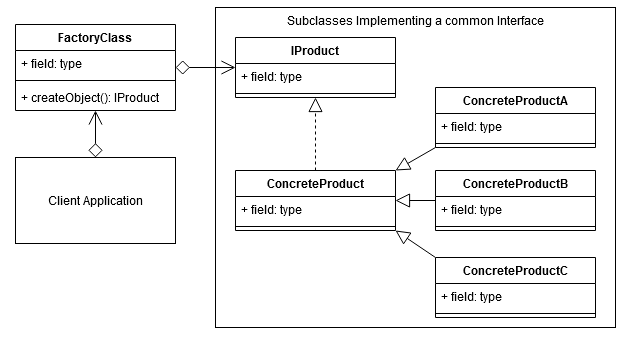

# Factory / Frabrique

## Le problème

On veut automatiser la création de certaines instances d'objets, ou se limiter à certains produits précis.

## Le patron de conception

## Avantages et inconvénients

+ Vous évitez un couplage étroit entre le créateur et les produits concrets.
+ Principe de responsabilité unique. Vous pouvez déplacer le code de création du produit en un seul endroit du programme, ce qui rend le code plus facile à supporter.
+ Principe d'ouverture/fermeture. Vous pouvez introduire de nouveaux types de produits dans le programme sans casser le code client existant.

- Le code peut devenir plus compliqué car vous devez introduire un grand nombre de nouvelles sous-classes pour mettre en œuvre le modèle. Le meilleur scénario est celui où vous introduisez le modèle dans une hiérarchie existante de classes de créateurs.
