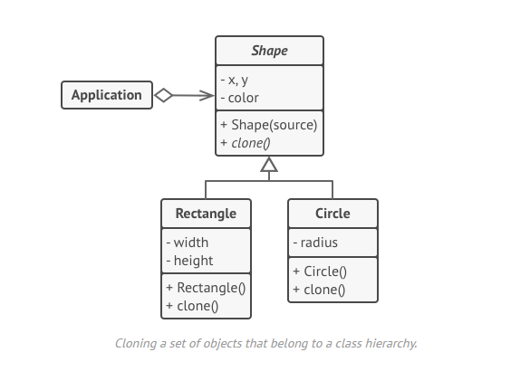

# Prototype / Prototype

## Le problème

Comment copier exactement un objet existant? On devrait boucler surtoutes ses propriétés pour le refaire, et de plus certaines de ses propriétés ne sont pas visibles et donc pas copiables.

## Le patron de conception

## Avantages et inconvénients

+ Vous pouvez cloner des objets sans les coupler à leurs classes concrètes.
+ Vous pouvez vous débarrasser du code d'initialisation répété en faveur du clonage de prototypes préconstruits.
+ Vous pouvez produire des objets complexes de manière plus pratique.
+ Vous obtenez une alternative à l'héritage lorsque vous traitez des préréglages de configuration pour des objets complexes.

- Le clonage d'objets complexes qui ont des références circulaires peut être très délicat.
