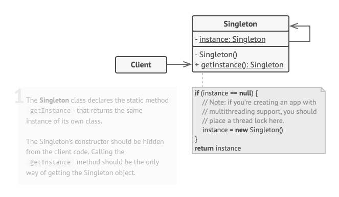

# Singleton / Singleton

## Le problème

1. S'assurer qu'une classe n'a qu'une seule instance. Par exemple un lien vers une base de données. Voici comment cela fonctionne : imaginez que vous avez créé un objet, mais après un certain temps, vous avez décidé d'en créer un nouveau. Au lieu de recevoir un nouvel objet, vous recevrez celui que vous avez déjà créé.
2. Fournir un point d'accès global à cette instance. Tout comme une variable globale, le modèle Singleton vous permet d'accéder à un objet depuis n'importe quel endroit du programme. Cependant, il protège également cette instance contre l'écrasement par d'autres codes.

## Le patron de conception

Rendez le constructeur par défaut privé, pour empêcher d'autres objets d'utiliser l'opérateur new avec la classe Singleton.
Créez une méthode de création statique qui agit comme un constructeur. Sous le capot, cette méthode appelle le constructeur privé pour créer un objet et l'enregistre dans un champ statique. Tous les appels suivants à cette méthode renvoient l'objet mis en cache.

## Avantages et inconvénients

+ Vous pouvez être sûr qu'une classe n'a qu'une seule instance.
+ Vous obtenez un point d'accès global à cette instance.
+ L'objet singleton n'est initialisé que lorsqu'il est demandé pour la première fois.

- Violation du principe de responsabilité unique. Le modèle résout deux problèmes à la fois.
- Le modèle Singleton peut masquer une mauvaise conception, par exemple, lorsque les composants du programme en savent trop les uns sur les autres.
- Le modèle nécessite un traitement spécial dans un environnement multithread afin que plusieurs threads ne créent pas un objet singleton plusieurs fois.
- Il peut être difficile de tester unitairement le code client du singleton car de nombreux cadres de test s'appuient sur l'héritage pour produire des objets fantaisie. Étant donné que le constructeur de la classe singleton est privé et que le remplacement des méthodes statiques est impossible dans la plupart des langages, vous devrez trouver un moyen créatif de simuler le singleton. Ou simplement ne pas écrire les tests. Ou bien n'utilisez pas le modèle Singleton.

Traduit avec www.DeepL.com/Translator (version gratuite)