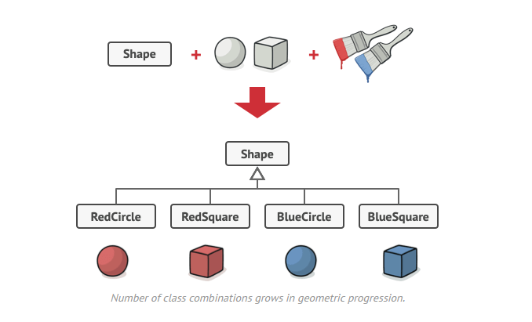
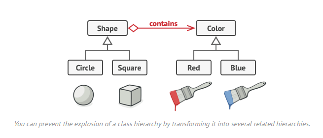
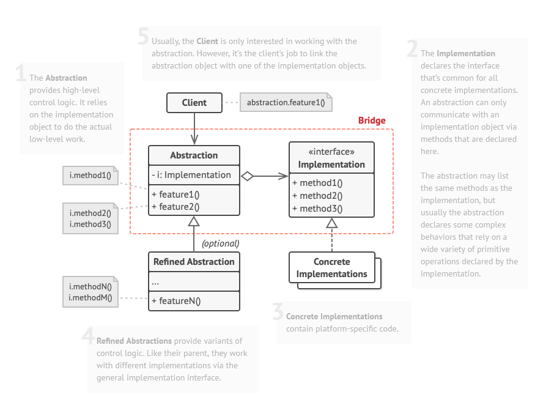

# Bridge / Pont

## Le problème

L'ajout de nouveaux types de formes et de couleurs à la hiérarchie la fera croître de façon exponentielle. Par exemple, pour ajouter une forme triangulaire, il faudrait introduire deux sous-classes, une pour chaque couleur. Et après cela, l'ajout d'une nouvelle couleur nécessiterait la création de trois sous-classes, une pour chaque type de forme. Plus on avance, plus la situation se dégrade.

## Le patron de conception

Puisque une forme doit être coloré, on ne peut pas considérer un Décorateur, car ce n'est pas une option.

Le patron:

## Avantages et inconvénients

+ Vous pouvez créer des classes et des applications indépendantes de la plate-forme.
+ Le code client travaille avec des abstractions de haut niveau. Il n'est pas exposé aux détails de la plate-forme.
+ Principe ouvert/fermé. Vous pouvez introduire de nouvelles abstractions et implémentations indépendamment les unes des autres.
+ Principe de responsabilité unique. Vous pouvez vous concentrer sur la logique de haut niveau dans l'abstraction et sur les détails de la plate-forme dans l'implémentation.

- Vous pouvez rendre le code plus compliqué en appliquant le modèle à une classe hautement cohésive.

