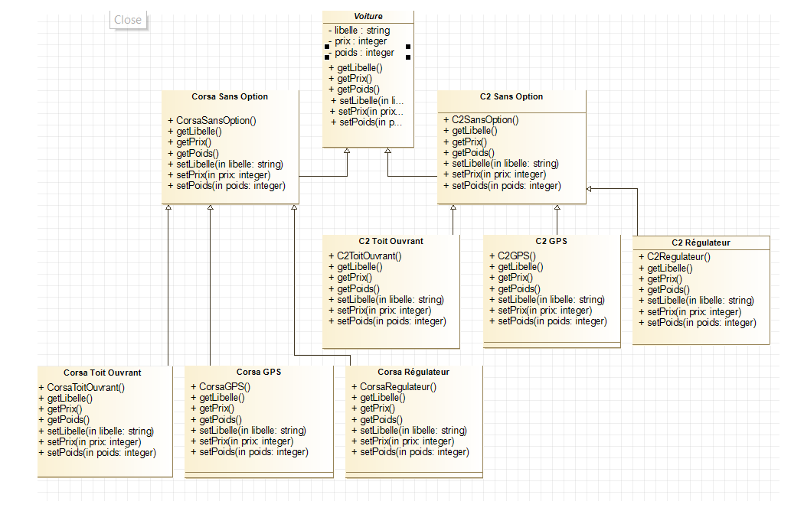
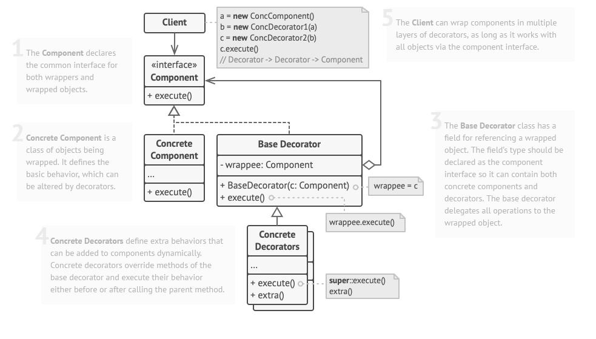

# Decorator / Décorateur

## Le problème

On peut se retrouver avec trop de sous-classes à gérer:

## Le patron de conception

Le décorateur permet de décorer un objet pour les ajouter des options.

Le patron:

## Avantages et inconvénients

+ Vous pouvez étendre le comportement d'un objet sans créer une nouvelle sous-classe.
+ Vous pouvez ajouter ou retirer des responsabilités à un objet au moment de l'exécution.
+ Vous pouvez combiner plusieurs comportements en enveloppant un objet dans plusieurs décorateurs.
+ Principe de responsabilité unique. Vous pouvez diviser une classe monolithique qui implémente de nombreuses variantes possibles de comportement en plusieurs classes plus petites.

- Il est difficile de retirer un wrapper spécifique de la pile de wrappers.
- Il est difficile d'implémenter un décorateur de manière à ce que son comportement ne dépende pas de l'ordre dans la pile des décorateurs.
- Le code de configuration initial des couches peut être assez laid.

