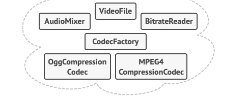
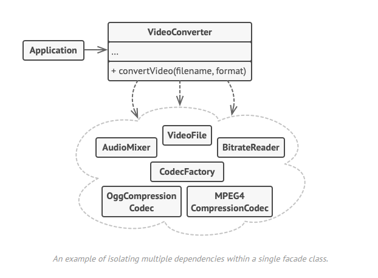

# Facade / Façade

## Le problème

Si on a une bibliothèque avec beaucoup de fonctions et de méthodes que l'on doit utiliser, 
cela peut vite devenir lourd pour coder et pour que les autres comprennent le code.

## Le patron de conception

On créé une classe utiliser ces fonction pour créer une méthode plsu haut niveau et qui sera facile à intégrer dans le code et facilement compréhensible.

## Avantages et inconvénients

+ Vous pouvez isoler votre code de la complexité d'un sous-système.

- Une façade peut devenir un objet dieu couplé à toutes les classes d'une application. (Il ne faut pas que cette classe deviene trop grande)
