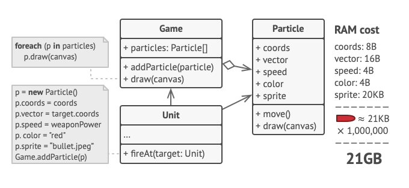
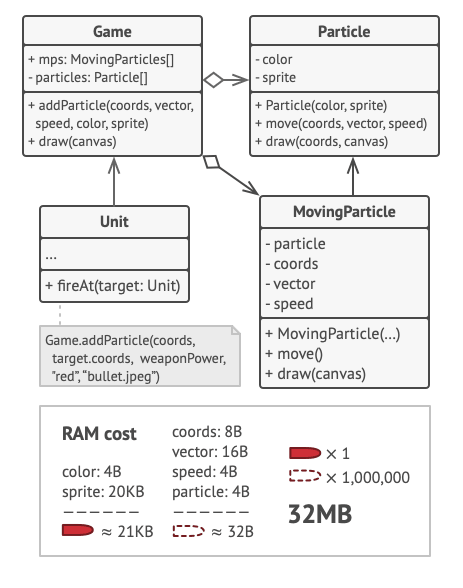
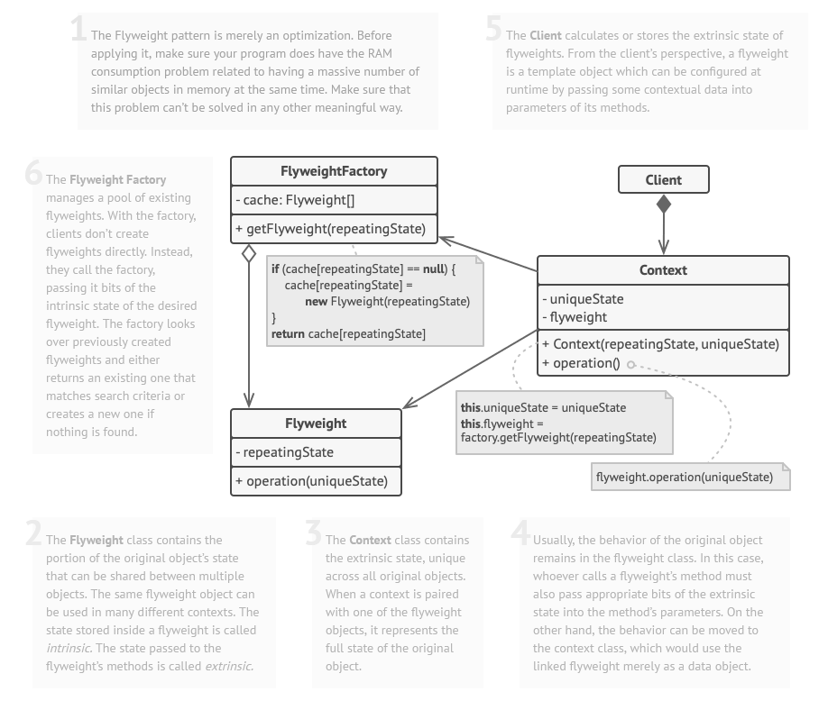

# Flyweight / Poids Mouche (or Cache)

## Le problème

To have some fun after long working hours, you decided to create a simple video game: players would be moving around a map and shooting each other. You chose to implement a realistic particle system and make it a distinctive feature of the game. Vast quantities of bullets, missiles, and shrapnel from explosions should fly all over the map and deliver a thrilling experience to the player.

The actual problem was related to your particle system. Each particle, such as a bullet, a missile or a piece of shrapnel was represented by a separate object containing plenty of data. At some point, when the carnage on a player’s screen reached its climax, newly created particles no longer fit into the remaining RAM, so the program crashed.

## Le patron de conception

En examinant de plus près la classe Particle, vous remarquerez que les champs couleur et sprite consomment beaucoup plus de mémoire que les autres champs. Le pire, c'est que ces deux champs stockent des données presque identiques pour toutes les particules. Par exemple, toutes les balles ont la même couleur et le même sprite.

Le modèle Flyweight suggère d'arrêter de stocker l'état extrinsèque à l'intérieur de l'objet. Au lieu de cela, vous devez transmettre cet état aux méthodes spécifiques qui en dépendent. Seul l'état intrinsèque reste dans l'objet, ce qui vous permet de le réutiliser dans différents contextes. Par conséquent, vous aurez besoin de moins de ces objets puisqu'ils ne diffèrent que par l'état intrinsèque, qui a beaucoup moins de variations que l'extrinsèque.

## Avantages et inconvénients

+ Vous pouvez économiser beaucoup de RAM, en supposant que votre programme a des tonnes d'objets similaires.

- Vous risquez d'échanger la RAM contre des cycles CPU lorsque certaines des données contextuelles doivent être recalculées à chaque fois que quelqu'un appelle une méthode de poids plume.
- Le code devient beaucoup plus compliqué. Les nouveaux membres de l'équipe se demanderont toujours pourquoi l'état d'une entité a été séparé de cette manière.

